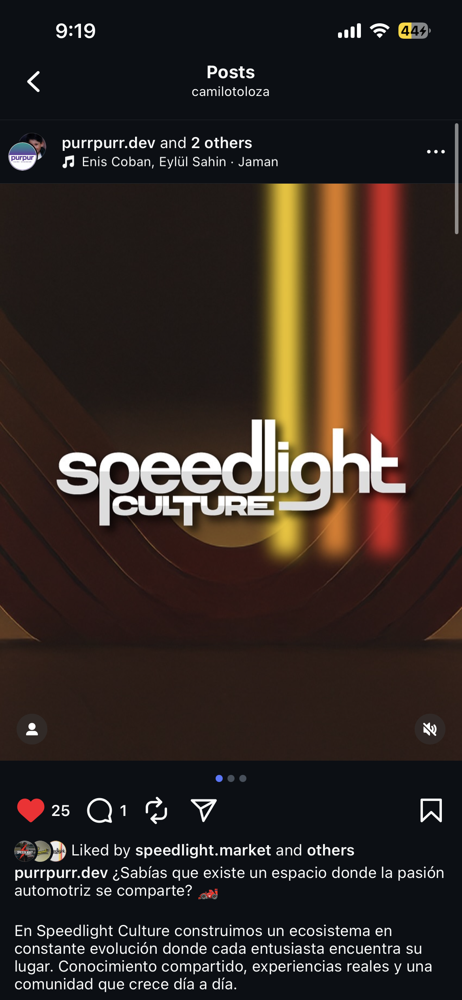

# Speedlight Culture Platform



**El garaje digital para la cultura automotriz** - Una plataforma web virtual con autenticación nativa, marketplace, foro comunitario, galería de alta resolución, mapa de talleres, sistema de video y agentes de IA.

## 🚀 Visión

Speedlight Culture es un homenaje a la cultura automotriz por parte de Colombia para el mundo. Combinamos tecnología de vanguardia con pasión automotriz para crear una comunidad global donde entusiastas, creadores y profesionales pueden conectarse, compartir y crecer.

## ✨ Características Principales

### 🛒 **Marketplace Automotriz**
- Compra y venta de partes, accesorios y servicios
- Sistema de reviews y calificaciones
- Categorías especializadas
- Integración de pagos seguros

### 💬 **Foro Comunitario**
- Discusiones temáticas por categorías
- Sistema de reputación y votos
- Moderación comunitaria
- Búsqueda avanzada

### 🖼️ **Galería de Alta Resolución**
- Plataforma para fotógrafos automotrices
- Resolución 4K+ con zoom detallado
- Sistema de derechos digitales
- Categorías por tipo de vehículo y evento

### 🗺️ **Mapa de Talleres**
- Mapa interactivo con talleres de personalización
- Filtros por especialidad y ubicación
- Sistema de reservas y citas
- Perfiles con portafolio

### 🎥 **Plataforma de Video**
- Upload y streaming de video
- Categorías: Reviews, tutoriales, eventos
- Sistema de comentarios y likes
- Live streaming para eventos

### 🤖 **Agentes de IA**
- Asistentes virtuales para recomendaciones
- Análisis de tendencias del mercado
- Moderación automática de contenido
- Generación de contenido personalizado

## 🎨 Diseño

### Paleta de Colores
- **Rojo Speedlight**: #D32F2F (pasión, velocidad)
- **Naranja Cultura**: #FF9800 (energía, creatividad)
- **Amarillo Energía**: #FFEB3B (optimismo, atención)
- **Ocre Tradición**: #C17D11 (tradición, tierra)
- **Fondo Oscuro**: #1A1A1A (contraste, elegancia)

### Filosofía
- **Mobile-first**: Diseño optimizado para dispositivos móviles
- **Aplicación real**: Experiencia similar a app nativa
- **Performance**: Carga rápida, animaciones suaves
- **Accesibilidad**: Diseño inclusivo para todos los usuarios

## 🛠️ Stack Tecnológico

### Frontend
- **Framework**: Next.js 14 (App Router)
- **Lenguaje**: TypeScript
- **Estilos**: Tailwind CSS v4
- **Estado**: Zustand + React Query
- **Formularios**: React Hook Form + Zod
- **Mapas**: Mapbox GL JS
- **Video**: Cloudflare Stream

### Backend
- **BaaS**: Supabase (PostgreSQL, Auth, Storage, Realtime)
- **Autenticación**: Supabase Auth (email + Google)
- **Base de Datos**: PostgreSQL
- **Storage**: Supabase Storage (imágenes/videos)
- **Realtime**: Supabase Realtime (chat, notificaciones)

### Servicios Externos
- **Pagos**: Stripe/MercadoPago
- **Email**: Resend
- **Analytics**: Google Analytics, Mixpanel
- **Monitoreo**: Sentry
- **CDN**: Cloudflare
- **IA**: OpenAI API, Google AI

## 📁 Estructura del Proyecto

```
speedlight_culture/
├── app/                    # Next.js App Router
│   ├── actions.ts         # Server actions
│   ├── globals.css        # Estilos globales
│   ├── layout.tsx         # Layout principal
│   └── page.tsx           # Página principal
├── docs/                  # Documentación
│   ├── PLATFORM_SPECIFICATION.md
│   ├── DESIGN_SYSTEM.md
│   ├── IMPLEMENTATION_PLAN.md
│   └── IMG_*.PNG          # Imágenes de referencia
├── marketing/             # Estrategias de marketing
├── supabase/              # Configuración de Supabase
│   └── migrations/        # Migraciones de base de datos
└── public/                # Assets estáticos
```

## 🚀 Empezando

### Prerrequisitos
- Node.js 18+ 
- npm o yarn
- Cuenta de Supabase
- Cuenta de Vercel (para despliegue)

### Instalación

1. Clonar el repositorio:
```bash
git clone https://github.com/tu-usuario/speedlight-culture.git
cd speedlight-culture
```

2. Instalar dependencias:
```bash
npm install
```

3. Configurar variables de entorno:
```bash
cp .env.example .env.local
# Editar .env.local con tus credenciales
```

4. Iniciar servidor de desarrollo:
```bash
npm run dev
```

5. Abrir [http://localhost:3000](http://localhost:3000) en tu navegador.

## 📋 Plan de Implementación

El desarrollo está dividido en 5 fases:

### Fase 1: Fundación (6 semanas)
- Configuración del proyecto
- Sistema de diseño
- Autenticación y perfiles

### Fase 2: Núcleo Comunitario (8 semanas)
- Foro comunitario
- Galería de imágenes
- Chat en tiempo real

### Fase 3: Marketplace y Video (10 semanas)
- Marketplace completo
- Plataforma de video
- Mapa de talleres

### Fase 4: Avanzado y Escalado (12 semanas)
- Sistema de suscripciones
- Agentes de IA
- Dashboards avanzados

### Fase 5: Lanzamiento (12 semanas)
- Testing y QA
- Marketing y lanzamiento
- Mejoras continuas

## 👥 Roles y Permisos

### Gratuito
- Acceso básico al foro
- Visualización de galería
- Búsqueda en marketplace
- Contenido con publicidad

### Creador (Premium)
- Todo lo gratuito +
- Sin publicidad
- Upload de videos
- Analytics de contenido
- Monetización

### Empresa
- Todo lo premium +
- Publicidad en plataforma
- Dashboard empresarial
- Analytics avanzados
- Soporte prioritario

### Administrador
- Gestión completa de plataforma
- Moderación de contenido
- Analytics globales
- Gestión de usuarios

## 💰 Modelo de Negocio

### Fuentes de Ingresos
1. **Suscripciones Premium**: $9.99/mes o $99/año
2. **Comisiones de Marketplace**: 5-10% por transacción
3. **Publicidad para Empresas**: Desde $500/mes
4. **Featured Listings**: $50-200/mes para talleres
5. **Programa de Afiliados**: Comisiones por referidos

### Estrategia de Marketing
- Contenido orgánico en redes sociales
- Colaboraciones con influencers automotrices
- Eventos presenciales y virtuales
- Programa de referidos
- SEO especializado en nicho automotriz

## 🤝 Contribuir

1. Fork el proyecto
2. Crear una rama feature (`git checkout -b feature/AmazingFeature`)
3. Commit cambios (`git commit -m 'Add some AmazingFeature'`)
4. Push a la rama (`git push origin feature/AmazingFeature`)
5. Abrir un Pull Request

## 📄 Licencia

Este proyecto está bajo la Licencia MIT. Ver `LICENSE` para más detalles.

## 📞 Contacto

- **Website**: [speedlightculture.com](https://speedlightculture.com)
- **Twitter**: [@speedlightculture](https://twitter.com/speedlightculture)
- **Email**: contacto@speedlightculture.com
- **Discord**: [Comunidad Speedlight Culture](https://discord.gg/speedlight)

## 🙏 Agradecimientos

- A toda la comunidad automotriz colombiana
- A los fotógrafos y creadores de contenido
- A los talleres y profesionales del sector
- Al equipo de desarrollo y diseño

---

**"Del rojo al amarillo, pasando por tonos ocres - Nuestra paleta, nuestra pasión."**

*© 2025 Speedlight Culture. Todos los derechos reservados.*
